# User Guide — Shared Mailbox & Kanban

A practical guide for agents and admins. Every screenshot below is from a real demo instance.

**Contents**
1. [Signing in](#1-signing-in)
2. [The layout](#2-the-layout)
3. [List view — working the inbox](#3-list-view--working-the-inbox)
4. [Thread drawer — reading & replying](#4-thread-drawer--reading--replying)
5. [Kanban board](#5-kanban-board)
6. [SLA — the ticket clock](#6-sla--the-ticket-clock)
7. [Bulk actions & cleanup](#7-bulk-actions--cleanup)
8. [Reports](#8-reports)
9. [Your profile & signature](#9-your-profile--signature)
10. [Admin setup (admins only)](#10-admin-setup-admins-only)
11. [FAQ / troubleshooting](#11-faq--troubleshooting)

---

## 1. Signing in

Sign in with your email + password, or **Continue with Google** if your admin has enabled it.

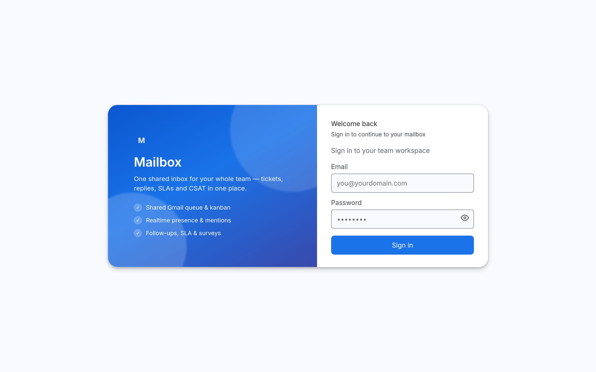

- **Agents** sign in with their email + password (or Google).
- **Admins** use the same screen — there is no separate admin login. Admin rights come from your account's *role*, so if Settings appears you're an admin.
- Forgot your password? Ask an admin to set a new one from **Settings → People**.

---

## 2. The layout

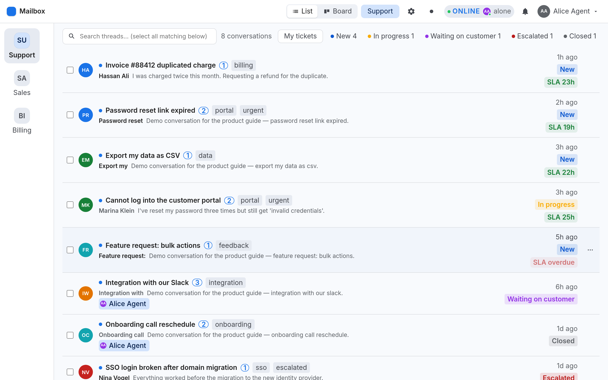

| Area | What it does |
|---|---|
| **Left rail** | Your mailboxes (Support, Sales, Billing…). Click to switch. |
| **Top bar** | **List / Board** toggle, the active mailbox name, ⚙ Settings, theme toggle, presence, notifications bell, and your account menu. |
| **Toolbar** | Search, **My tickets**, status filter chips, and the conversation count. |
| **Rows** | One conversation each: customer, subject, snippet, labels, assignee, status, SLA chip, time. |
| **Hover a row** | A **⋯** button appears — assign or label the ticket without opening it. |

**Keyboard/touch note:** on phones and tablets the **⋯** button is always visible (there's no hover on touch).

---

## 3. List view — working the inbox

### Search

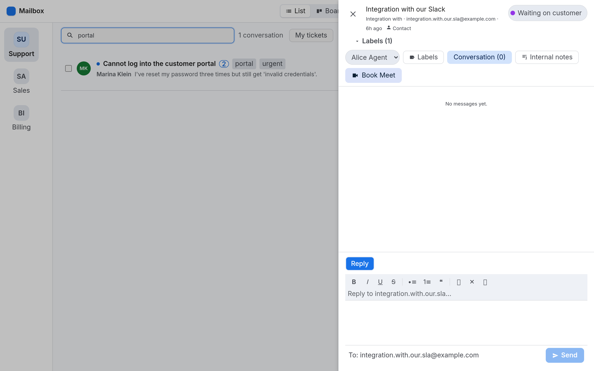

Type anything — subject, customer name, email, or snippet. The count at the top shows how many conversations matched. Clear the box to go back to the full list.

### Filter: My tickets & status chips

- **My tickets** — only conversations assigned to *you*.
- **Status chips** (New / In progress / Waiting on customer / Escalated / Closed) — click to filter by status; click again to clear.
- **Label chip** — click a label (e.g. `#billing`) to see only those conversations.

### Quick actions (⋯)

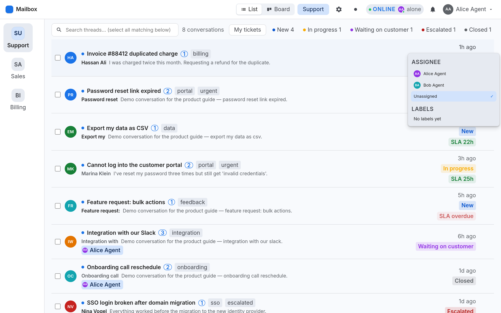

Hover any row and click the **⋯** to, **without opening the thread**:

- **Assign** the conversation to an agent (or Unassigned)
- **Toggle labels** on/off

Everything applies instantly. (Sending a canned reply from here was removed — replies always go through the composer so they thread correctly.)

---

## 4. Thread drawer — reading & replying

Click any conversation to open it on the right. The list stays visible on the left.

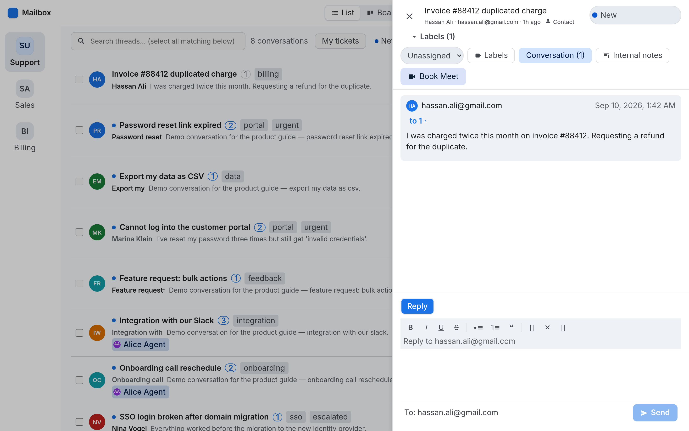

**Header** — subject, customer, **Contact** (opens the contact panel with tags + related cases), and the status pill (click to change status).

**Toolbar** — *Unassigned*/assignee, **Labels**, **Conversation** / **Internal notes** tabs, **Book Meet**.

**Conversation** — every message in order (oldest → newest). Attachments from customers appear as downloadable chips. Internal notes are shown in a distinct style and are never emailed.

### Replying

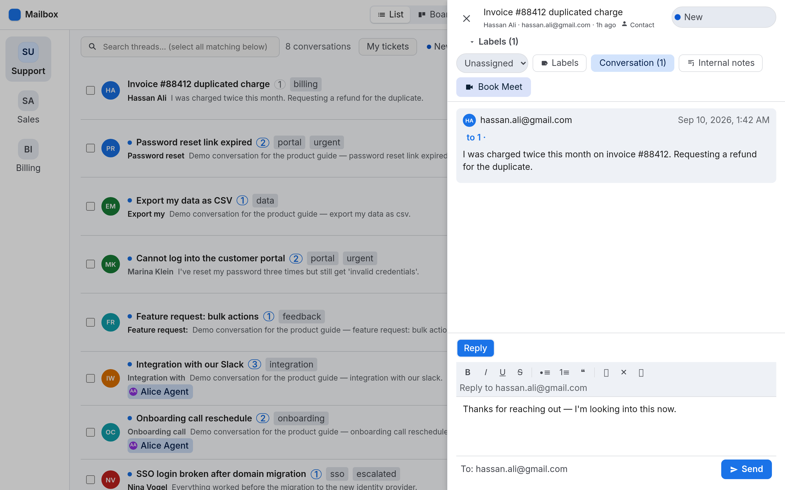

1. Click into the reply box and type.
2. Use the toolbar for **bold / italic / underline / strike**, lists, quote, inline code, links.
3. **Reply** vs **Reply all** — choose the mode at the top of the composer; add **cc** recipients if needed.
4. **Send**.

**Canned responses:** type `/` in the reply box to open the list (e.g. `/hours`). Inserted text automatically fills placeholders like `{{customer_name}}`, `{{customer_email}}`, `{{subject}}` and `{{inbox}}` from the open ticket — anything unknown is left as-is.

**Signatures:** if you have auto-insert on, your signature appears **in the editor as you type** (Gmail-style). You can edit or delete it — what you see is what gets sent. The **✍️** button inserts it manually.

---

## 5. Kanban board

Click **Board** in the top bar.

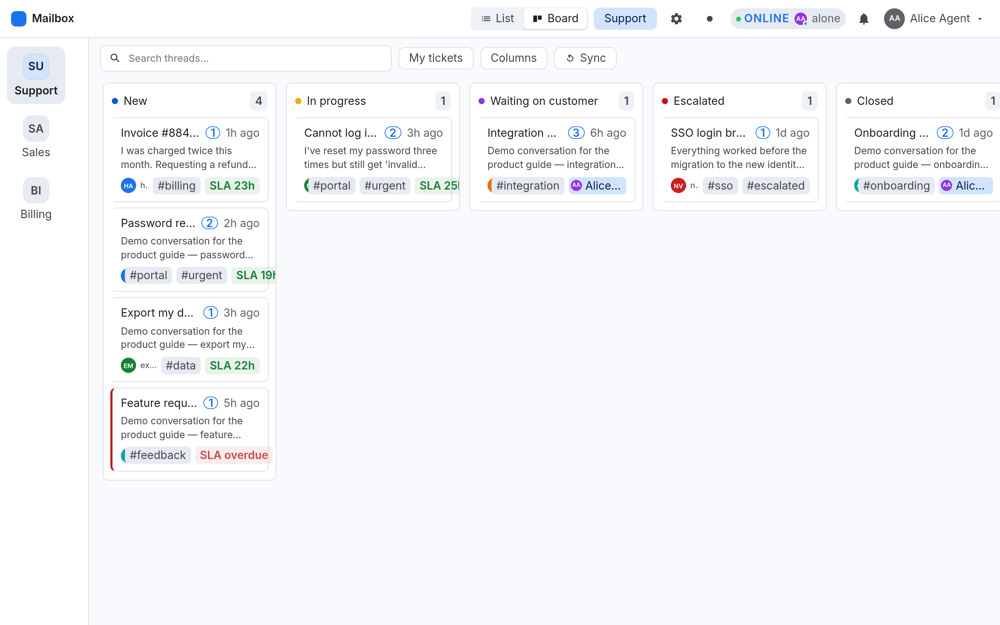

Each column is a status. Cards show the customer, subject, snippet, labels, assignee and SLA chip.

### Moving tickets

**Drag a card onto another column** to change its status. The change saves immediately and shows up in every other open session within a few seconds.

### Show / hide columns

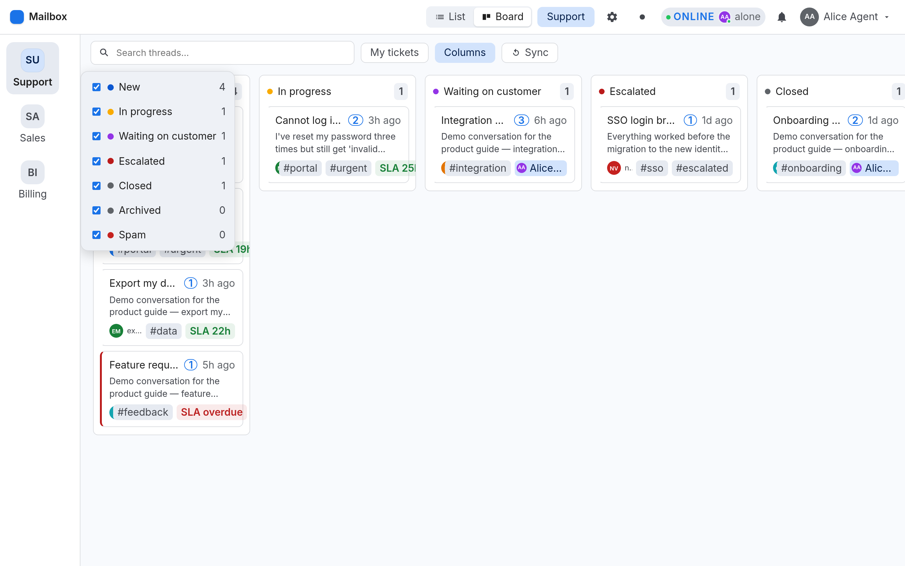

Click **Columns** in the board toolbar to tick/untick statuses (each shows a live count). Hidden columns disappear from your board only — preference is saved per user, so it survives refresh and re-login.

### Select mode

Click **Select…** to check multiple cards (drag is disabled while selecting), then use the bulk bar at the top.

---

## 6. SLA — the ticket clock

Tickets in **New** and **In progress** carry a deadline, shown as a chip on the row and the card:

| Chip | Meaning |
|---|---|
| 🟢 `SLA 23h` | On track — plenty of time left |
| 🟠 `Due in 3h` | Inside the warning window (last 20% of the window, minimum 2h) |
| 🔴 `SLA overdue` | Past the deadline (pulses red) |

**What happens when it breaches:** an hourly monitor checks overdue New/In-progress tickets and **escalates** them — the status flips to **Escalated**, an internal note (⏰ *SLA breach…*) is added, and an alert webhook fires if one is configured.

Admins control this in **Settings → Automation → SLA & escalation** — the enable switch and the number of hours. With SLA off, there are no chips and nothing auto-escalates.

> **Note:** the clock follows the *customer's* message time, not when the record was imported. Old mail imported from a mailbox history will show as overdue if it was never answered — that's accurate, not a bug.

---

## 7. Bulk actions & cleanup

Perfect for initial clean-up after connecting a mailbox.

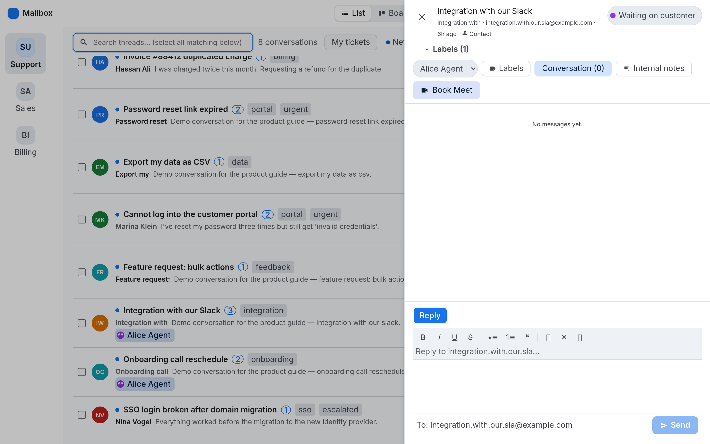

1. Tick individual rows, or use **Select all N matching** after a search — this selects *every* conversation matching your filters, not just the visible ones.
2. Choose an action:
   - **Close** — mark resolved
   - **Archive** — out of the way, still searchable (Archived chip/column)
   - **Mark spam** — junk (Spam chip/column)
   - **Delete** — permanently removes the conversation and its messages (**admins only**, asks to confirm)
   - **Clear** — cancel the selection

**Tip:** clean up a noisy mailbox in seconds — search `Security alert` → **Select all matching** → **Mark spam**.

---

## 8. Reports

Account menu → **Reports**.

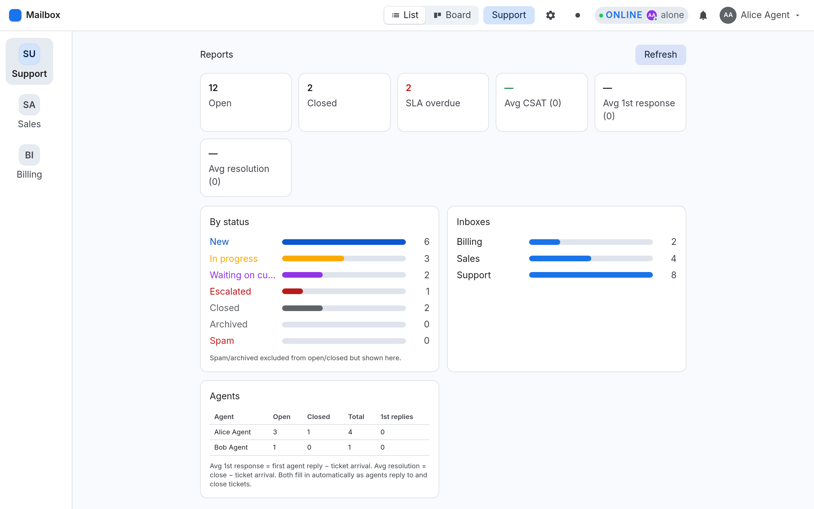

| Card | Meaning |
|---|---|
| **Open** / **Closed** | Current workload |
| **SLA overdue** | Tickets past their deadline right now |
| **Avg CSAT** | Average customer rating (with response count) |
| **Avg 1st response** | Average time from the customer's message to the first agent reply |
| **Avg resolution** | Average time from the customer's message to the ticket being closed |

Below: a **By status** breakdown, per-mailbox volume, and a per-agent table (open / closed / total / **1st replies**).

> First-response and resolution averages only count tickets that have actually been replied to / closed since tracking began — they fill in as your team works.

---

## 9. Your profile & signature

Account menu → **My profile**.

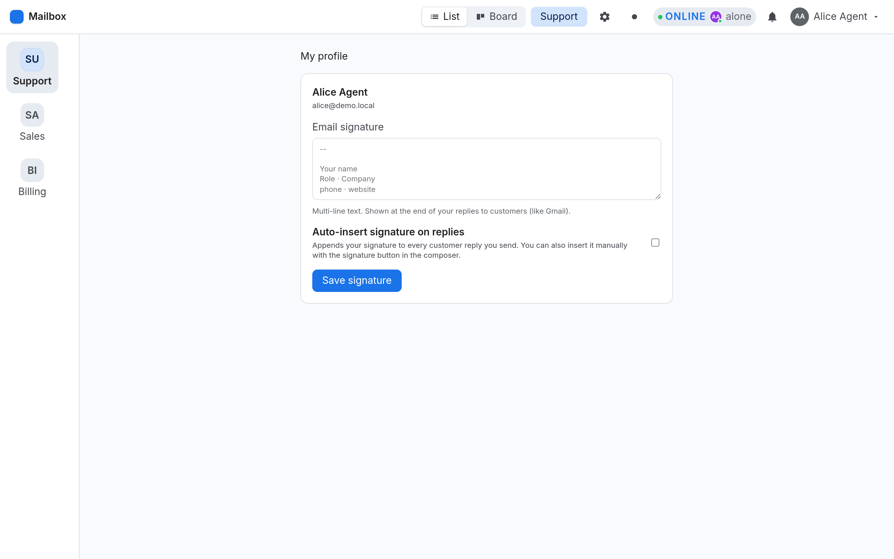

- **Signature** — what gets appended to your replies. Multi-line; plain text.
- **Auto-insert signature on replies** — when on, the signature appears live in the reply editor as you type.

Admins can also set signatures on an agent's behalf in **Settings → People → Agents & signatures**.

---

## 10. Admin setup (admins only)

⚙ (or account menu) → **Settings**. Sections are grouped into tabs.

### Connection

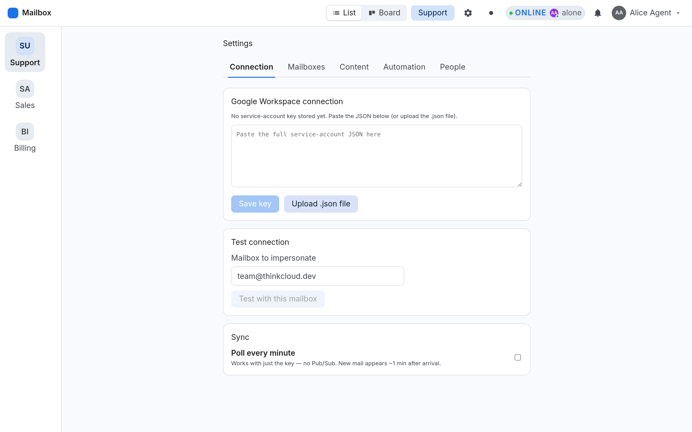

Paste your Google **service-account JSON** (or upload the file), then **Test connection** with a mailbox address. This is what lets the app read and send mail on behalf of your mailboxes.

### Mailboxes
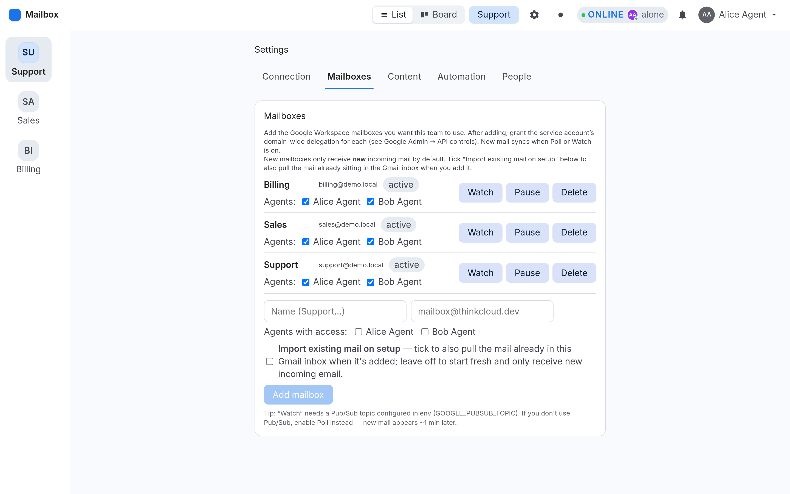

- **Add mailbox** — name + address, pick which agents get access, and choose:
  **Import existing mail on setup** (ticked = pull the mailbox's existing Gmail history into the queue; **unticked = start fresh and only receive new mail** — the default).
- **Watch** — real-time delivery via Google Pub/Sub (needs `GOOGLE_PUBSUB_TOPIC` configured). If you don't use Pub/Sub, enable **Poll** in the Sync section instead — new mail arrives within about a minute.
- **Pause / Activate**, **Delete**, and per-mailbox agent access.

> ⚠️ After adding a mailbox you must grant the service account **domain-wide delegation** for that address in Google Admin → Security → API controls, or nothing will sync. See the admin handover notes for the exact procedure.

### Content
**Labels & categories** (used for tags like `billing`, `urgent`) and **Canned responses** (used with `/` in the composer).

### Automation
**Ticket automations** — follow-up nudges (delay, interval, max) and auto-close for customers who never reply.
**SLA & escalation** — enable/disable and set the first-response hours.

### People
**Mentions & notifications** — which admins can be @mentioned.
**Agents & signatures** — set an agent's signature and auto-insert on their behalf.
**Customer satisfaction (CSAT)** — off by default. When enabled, closing a ticket emails the customer a short survey link; the rating and comment appear in the ticket.

### Sync
**Poll every minute** — the simplest way to keep mail flowing without Pub/Sub.

---

## 11. FAQ / troubleshooting

**I moved/closed a ticket and my teammate's screen didn't update.**
Open sessions re-sync every ~10 seconds, and immediately when you switch back to the tab. If a session still looks stale, **hard-refresh** it (Cmd/Ctrl+Shift+R) — it's almost always an old cached bundle.

**A customer's reply didn't appear.**
Check **Settings → Sync** (Poll on or Watch configured) and that the mailbox is **active**. New mail appears within about a minute with polling.

**The customer says they never got my reply.**
Check the thread — if it shows as sent, it went out. Replies go from the mailbox address, and land in the customer's existing conversation (they're threaded by the original subject + message ID).

**Why is an old ticket showing as "SLA overdue"?**
The clock is anchored to the customer's real message date. Mail imported from history that was never answered is genuinely overdue. Close/archive those (see bulk actions) and they leave the queue.

**How do I clean up hundreds of old conversations?**
Search → **Select all matching** → **Mark spam** (or Archive/Delete for admins). See section 7.

**A ticket is in Escalated — did something break?**
No — that's the SLA monitor doing its job. Escalated means the ticket blew its deadline. Open it, read the ⏰ note, and work it like any other ticket.

**Can I change the status names or make a Sales pipeline?**
Not currently — the seven statuses are fixed. Use **labels** for pipeline stages (e.g. `lead`, `contacted`, `proposal`, `won`) and filter by them.

---

*Screenshots captured from a demo instance with sample data — no real customer information.*
